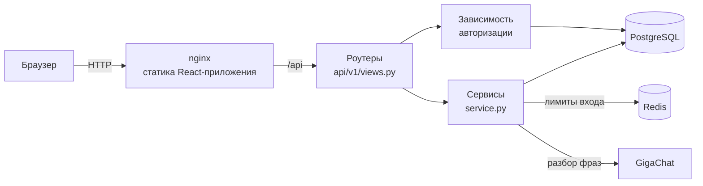

# Money Tracker — учёт личных финансов

[](https://github.com/sanakoy/money-tracker/actions/workflows/ci.yml)


Веб-приложение для учёта доходов и расходов: пользователь заводит категории, записывает траты в два касания и смотрит, куда уходят деньги за месяц или любой период. Бэкенд — асинхронный FastAPI + PostgreSQL, авторизация на JWT с ротацией refresh-токенов, ограничение попыток входа через Redis. Фронтенд — React + TypeScript.

## Возможности

- **Запись в два касания:** плитка категории → сумма в окне
- **Запись словами:** «кофе 350 вчера» → языковая модель предлагает черновик записи, вы проверяете его и сохраняете
- **Категории** доходов и расходов с иконками и суммой за месяц
- **Структура месяца:** доли категорий в расходах и доходах
- **Статистика** за месяц или любой период из календаря: график по дням стопками по категориям, рейтинг категорий, список записей с правкой и удалением
- **Авторизация:** регистрация по email, вход, обновление и отзыв токенов, выход
- **Изоляция данных:** каждый видит только свои категории и операции

## Стек

| | |
|---|---|
| Бэкенд | FastAPI, Pydantic 2, SQLAlchemy 2.0 (async), asyncpg |
| Фронтенд | React 19, TypeScript, Vite, TanStack Query, React Router, Tailwind CSS, shadcn/ui, Recharts |
| Хранилища | PostgreSQL 15, Redis 7 |
| LLM | GigaChat (официальный SDK): структурированный вывод через вызов функции |
| Миграции | Alembic |
| Авторизация | PyJWT, bcrypt |
| Тесты | pytest, pytest-asyncio, httpx, vitest |
| Качество | ruff, black, mypy, oxlint, GitHub Actions |
| Окружение | uv, npm, Docker, Docker Compose, nginx |

## Быстрый старт

Нужен только Docker.

```bash
git clone https://github.com/sanakoy/money-tracker.git
cd money-tracker
cp .env.example .env
```

В `.env` задайте `SECRET_TOKEN_KEY` — ключ подписи токенов:

```bash
python -c "import secrets; print(secrets.token_urlsafe(32))"
```

Запуск:

```bash
docker compose up -d --build
```

Поднимутся фронтенд (nginx), бэкенд, PostgreSQL и Redis. Миграции применяются автоматически при старте контейнера бэкенда.

- Приложение: **http://localhost:8080** — зарегистрируйтесь и заведите первую категорию плиткой «+»
- Документация API: **http://127.0.0.1:8000/docs**

nginx отдаёт собранный фронтенд и проксирует `/api` в бэкенд: для браузера всё живёт на одном адресе, поэтому не нужен CORS, а refresh-cookie работает без дополнительных настроек.

## Разработка

Бэкенд можно запускать на хосте, а в Docker держать только базы:

```bash
docker compose --profile test up -d postgres postgres_test redis

uv sync                                             # окружение по pyproject.toml и uv.lock
uv run alembic upgrade head                         # миграции
uv run uvicorn src.main:app --reload --port 8001    # сервер с автоперезагрузкой
```

Тестовая база лежит в профиле `test` и без `--profile test` не поднимается.

Фронтенд с горячей перезагрузкой (Vite проксирует `/api` на бэкенд из Docker, `127.0.0.1:8000`):

```bash
cd frontend
npm ci
npm run dev        # http://localhost:5173
npm run gen:api    # типы API из OpenAPI бэкенда в src/api/schema.d.ts
```

### Тесты и проверки

```bash
uv run pytest                    # 224 теста против настоящих PostgreSQL и Redis
uv run pytest -m live            # тесты с настоящим GigaChat: сеть, ключ в .env
uv run ruff check src tests      # линтер
uv run black --check src tests   # форматирование
uv run mypy                      # типы

cd frontend
npm run lint                     # oxlint
npm test                         # vitest
npm run build                    # проверка типов и сборка
```

Всё это же запускает CI на каждый push в `main`/`develop` и на каждый pull request, а заодно проверяет, что оба Docker-образа собираются.

## API

Все ручки, кроме авторизации и health-проверок, требуют заголовок `Authorization: Bearer <access_token>`.

**Авторизация** — `/api/v1/auth`

| Метод | Путь | Что делает |
|---|---|---|
| POST | `/register` | регистрация по email и паролю |
| POST | `/login` | access-токен в теле ответа, refresh-токен в httpOnly cookie |
| POST | `/refresh` | новая пара токенов, старый refresh отзывается |
| POST | `/logout` | отзыв refresh-токена, удаление cookie |
| GET | `/me` | текущий пользователь |

**Категории** — `/api/v1/categories`

| Метод | Путь | Что делает |
|---|---|---|
| GET | `/spending`, `/profit` | категории расходов или доходов с суммами за месяц (`year`+`month`, по умолчанию текущий) |
| POST | `/create` | создать категорию; имя уникально в пределах типа, иначе 409 |
| PATCH | `/update/{id}` | переименовать, сменить иконку |
| DELETE | `/delete/{id}` | удалить вместе с операциями |

**Операции** — `/api/v1/operations`

| Метод | Путь | Что делает |
|---|---|---|
| GET | `/` | список с фильтрами: месяц (`year`+`month`) или период (`date_from`+`date_to`), `category_id`, `operation` |
| GET | `/totals?date_from=&date_to=` | доход, расход, суммы категорий и суммы по дням за период — для статистики |
| POST | `/parse` | черновик операции из фразы «кофе 350 вчера»; ничего не записывает |
| POST | `/create` | добавить операцию |
| PATCH | `/update/{id}` | изменить сумму, комментарий, дату |
| DELETE | `/delete/{id}` | удалить |

**Служебные**

| Метод | Путь | Что делает |
|---|---|---|
| GET | `/health` | процесс жив (без обращения к зависимостям) |
| GET | `/ready` | готов принимать трафик: PostgreSQL и Redis доступны, иначе 503 |

## Архитектура



Каждый домен (`auth`, `category`, `operation`) устроен одинаково:

```
src/<домен>/
├── models.py        # модели SQLAlchemy
├── schemas.py       # схемы Pydantic
├── service.py       # бизнес-логика и запросы к БД
└── api/v1/views.py  # ручки FastAPI
```

Ручки тонкие: разбирают запрос и зовут сервис. Сервис пишет запросы явно через `AsyncSession` и делает **один `commit` на бизнес-операцию**, поэтому составные действия атомарны.

## Инженерные решения

**Запись словами: модель предлагает, код проверяет, человек подтверждает.** Фраза «кофе 350 вчера» уходит в GigaChat вместе со списком категорий пользователя — только его. Модель возвращает объект по JSON-схеме, где категория ограничена этим списком, а вместо даты указано, сколько дней назад была трата: считать календарь модели даются хуже, дату вычисляет код. Ответ проверяется как любой внешний ввод: категория — только своя, сумма больше нуля или пустая, комментарий не длиннее колонки. В базу ничего не пишется: черновик открывается в обычном окне записи, и сохраняет его человек. Схему модель получает как параметры функции, которую обязана вызвать. Прямой способ (`response_format`) на GigaChat-2 с рабочим промптом возвращал пустой ответ на треть фраз, а вызов функции — верный ответ на все 12 тестовых. Код фич зависит от интерфейса `LLMClient`, а не от SDK. Поэтому тесты подставляют фейковую модель, а провайдера можно заменить. Отдельные live-тесты проверяют связку с настоящим GigaChat.

**Refresh-токены с ротацией и обнаружением кражи.** Refresh — случайная строка в httpOnly cookie с `SameSite=strict` и `Secure`, в базе хранится только её sha256-хеш. Каждый `/refresh` отзывает старый токен и выдаёт новый в той же цепочке (`family_id`). Если приходит уже отозванный токен, значит, его украли: гасится вся цепочка этого входа, другие устройства пользователя продолжают работать. Два одновременных `/refresh` с одним токеном не пройдут оба — запись блокируется через `SELECT ... FOR UPDATE`.

**Ограничение попыток входа.** Счётчики в Redis: 5 неудачных попыток на email за 15 минут и 20 на IP за 5 минут, при превышении — 429 с `Retry-After`. Проверка идёт до bcrypt, а увеличение счётчика и сравнение с лимитом — одна атомарная операция (`INCR`), поэтому параллельные запросы лимит не обходят. Несуществующий email ограничивается так же, как существующий, чтобы по ответам нельзя было узнать, кто зарегистрирован. По той же причине время ответа на неверный пароль и на неизвестный email одинаковое.

**404, а не 403, на чужие данные.** Чужая и несуществующая категория отвечают одинаково: иначе перебором id можно выяснить, какие объекты существуют.

**Суммы считаются, а не хранятся.** Сумма по категории — это `SUM` по операциям за нужный период. Денормализованную колонку с суммой удалили: она обновлялась на каждой операции, но нигде не читалась.

**Миграции проверяются тестами.** Тестовая база строится миграциями Alembic, а не `create_all`, поэтому тесты заодно проверяют, что миграции применяются. Отдельные тесты сверяют модели со схемой после миграций (забытая миграция роняет CI) и для каждой ревизии делают upgrade → downgrade → upgrade (ловят сломанные откаты).

**Тесты проверяют причину отказа.** Негативный тест (404, 401, 429) создаёт живой объект или токен и в конце делает контрольный запрос, который проходит. Иначе тест пройдёт и тогда, когда ручка отвечает ошибкой на всё подряд.

**Воспроизводимое окружение.** Прямые зависимости — в `pyproject.toml`, точные версии всего дерева — в `uv.lock`. CI и Docker ставят их с `--locked` и падают, если lock разошёлся с описанием.

**Docker-образы для прода.** Обе сборки в две стадии: в образ бэкенда не попадают pytest, mypy и прочие инструменты разработки (270 МБ вместо 461), в образ фронтенда — Node и `node_modules`, только nginx и статика (83 МБ). Оба процесса работают не от root. Контейнеры стартуют по цепочке healthcheck: базы → бэкенд → nginx.

**nginx перед приложением.** Файлы сборки с хешем в имени кешируются на год, `index.html` — нет, поэтому после деплоя браузер сразу получает новую версию. Отсутствующий старый чанк отдаётся как 404, а не `index.html`: вкладка, открытая до деплоя, покажет «Обновите страницу», а не упадёт на HTML вместо JavaScript. Заголовки безопасности, включая Content-Security-Policy без `unsafe-inline` для скриптов.

**Настоящий IP клиента за прокси.** Лимит попыток входа по IP за nginx видел бы адрес самого nginx и стал бы общим на всех. nginx передаёт адрес клиента в `X-Forwarded-For`, но присланный клиентом заголовок не дописывает, а заменяет: иначе подстановкой случайного IP лимит обходился бы.

**Обновление токена в нескольких вкладках.** Refresh ротируется на каждый запрос, а повтор старого токена гасит сессию. Поэтому вкладки обновляют токен по очереди, под блокировкой Web Locks: браузер, восстановивший несколько вкладок сразу, не выкидывает пользователя на вход.

## Структура проекта

```
├── src/
│   ├── auth/            # регистрация, вход, токены, лимиты входа
│   ├── category/        # категории и статистика
│   ├── operation/       # операции
│   ├── health/          # /health и /ready
│   ├── llm/             # клиент языковой модели (GigaChat)
│   ├── database.py      # движок и сессии SQLAlchemy
│   ├── redis_client.py  # клиент Redis
│   ├── settings.py      # настройки из .env
│   └── main.py          # приложение, CORS, lifespan
├── migrations/          # миграции Alembic
├── certs/               # корневой сертификат Минцифры для GigaChat
├── tests/               # pytest
├── docker/              # entrypoint контейнера бэкенда
├── frontend/            # React-приложение
│   ├── src/
│   ├── docker/          # конфигурация nginx
│   └── Dockerfile
├── Dockerfile
├── docker-compose.yml
├── pyproject.toml       # зависимости и настройки инструментов
└── uv.lock              # зафиксированные версии
```

## Что дальше

- деплой с публикацией Docker-образов в GitHub Container Registry
- e2e-тесты основных сценариев на Playwright
- нагрузочное тестирование и оптимизация по замерам
